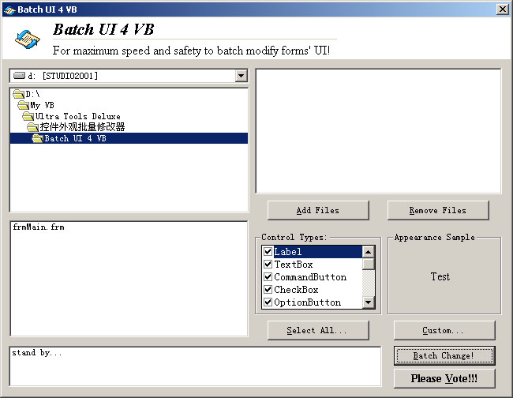



## Batch UI 4 VB \- For Maximum Speed & Safety to Batch Modify Forms' UI \- A Must See\!\!\!

### Description

Batch UI 4 VB, for maximum speed and safety to batch modify forms' UI!

wanna Save your time when changing the appearance of your forms?

Batch UI 4 VB is intended to batch change the appearance of forms,

such as fonts, borders, etc with high speed!

Batch UI 4 VB strictly follows the coding standards with a nice UI.

Please vote & commend for Batch UI 4 VB for a better speed and safety

with custom borders, styles, texts, captions, tooltips, menus and more!!!!!!
 
### More Info
 

             |
---                |---
**Submitted On**   |2002-04-14 00:35:50
**By**             |[enmity](https://github.com/Planet-Source-Code/PSCIndex/blob/master/ByAuthor/enmity.md)
**Level**          |Advanced
**User Rating**    |4.7 (28 globes from 6 users)
**Compatibility**  |VB 4\.0 \(32\-bit\), VB 5\.0, VB 6\.0
**Category**       |[Complete Applications](https://github.com/Planet-Source-Code/PSCIndex/blob/master/ByCategory/complete-applications__1-27.md)
**World**          |[Visual Basic](https://github.com/Planet-Source-Code/PSCIndex/blob/master/ByWorld/visual-basic.md)
**Archive File**   |[Batch\_UI\_4716534132002\.zip](https://github.com/Planet-Source-Code/enmity-batch-ui-4-vb-for-maximum-speed-safety-to-batch-modify-forms-ui-a-must-see__1-33767/archive/master.zip)

